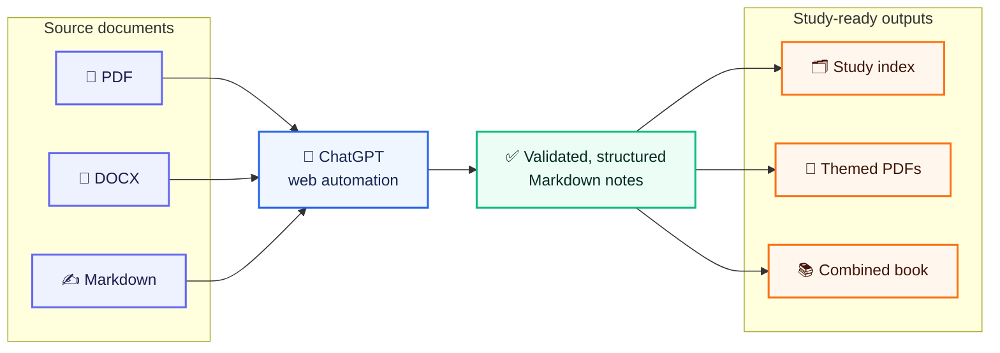

<div align="center">

# ChatGPT Note Maker

**Turn PDFs, DOCX files, and long Markdown documents into structured study notes through the ChatGPT web interface — then export polished PDFs and combined study books.**

[](CHANGELOG.md)
[](#requirements)
[](#requirements)
[](#testing)
[](LICENSE)

</div>



Note Maker is a local automation toolkit for repeatable, high-volume note production. It drives the ChatGPT web UI, uploads source material, captures downloadable artifacts, validates generated files, resumes interrupted batches, and optionally converts the results into publication-ready study PDFs.

It was built for dense university and medical material, but the workflow works with any prompt that asks ChatGPT to return a downloadable Markdown or OPML artifact.

> [!IMPORTANT]
> This project automates the ChatGPT website. UI changes, rate limits, authentication challenges, and account restrictions can affect runs. Start with one worker and non-sensitive test files.

## Project documentation

- [CLI: interactive runs, projects, previews, and status](docs/CLI.md)
- [Unified configuration and CLI](docs/configuration.md) — configuration precedence, environment overrides, run previews
- [Runtime environment variables](docs/runtime-variables.md) — complete `NOTE_MAKER_*` reference
- [Branch integration and validation report (فارسی)](docs/INTEGRATION_REPORT_FA.md)
- [Implementation reports (فارسی)](docs/implementation-reports/README.md)
- [Architecture decisions](docs/adr/README.md)
- [Release checklist](RELEASE_CHECKLIST.md)
- [Changelog](CHANGELOG.md)

## Highlights

- **Batch processing** for PDF, DOCX, and Markdown section workflows
- **Managed browser sessions** with reusable login snapshots and isolated worker profiles
- **Selenium or Patchright** browser providers
- **Safe resume support** using content hashes and a persistent manifest
- **Output validation** before an existing note is replaced
- **Parallel execution** with isolated workers and dynamic job dispatch
- **Coordinator job watchdog** that recycles workers whose jobs exceed the hard execution deadline
- **Rate-limit and authentication protection** through global cooldowns and circuit breakers
- **Diagnostics** including metadata, response captures, and screenshots for final failures
- **Study-index generation** with chapter, session, page-range, and study-focus metadata
- **High-quality PDF export** with themes, presets, RTL detection, and custom CSS
- **Combined study books** with bookmarks, internal links, and continuous page numbering
- **Legacy OPML/XMind workflows** for mind-map generation

### Resilience features added in 0.9.0

- **Current-UI selector registry** — assistant-message detection covers both the legacy and current ChatGPT markup (including the new markdown-text-style container) for *both* browser providers, with double-counting protection. Future UI changes are a one-line registry edit, not a code hunt.
- **Bounded rate-limit re-check** — transient rate-limit modals are dismissed and the wait continues; a retry (with the proper cooldown) only happens when the modal cannot be dismissed or persists. Measured against 74 real rate-limit events.
- **Thinking-effort verification** — set `CHATGPT_REQUIRED_EFFORT=high` and every submission verifies the composer's reasoning-effort setting first, adjusting it via the slider when needed, and fails closed on mismatch. No more batches silently generated at the wrong effort.
- **Inline Markdown delivery** — set `NOTE_MAKER_INLINE_MARKDOWN=1` to deliver `.md` sources inline (wrapped in BEGIN/END markers) instead of uploading, bypassing the upload UI entirely. `NOTE_MAKER_INLINE_MAX_CHARS` (default 50,000) falls back to normal upload for oversized sources. Prompt hashes are computed on the original prompt only, so resume matching is unaffected by delivery mode.
- **Modernized composer uploads** — handles the redesigned two-step attach menu (the document input only exists after choosing "Upload from computer") and never feeds documents into photo-only inputs.
- **Scheduled rest** — pause workers automatically after every N successful files (e.g. 30 minutes after each 30 files), with persistent state that survives restarts and a global completed-count offset for multi-subject batches. See [Scheduled rest](#scheduled-rest).
- **Run observability** — `summary.json` now records `download_fallbacks`, `last_fallback_reason`, per-job `delivery_modes`, and `interrupted_at_stage`, so the next ChatGPT UI change is detectable from aggregate summaries instead of grep sessions.
- **Hardened diagnostics** — when the screenshot capture fails (typically a dead driver), the page source is captured automatically so the failure is still debuggable.
- **`doctor` preflight** — `note-maker doctor` now validates the rest schedule (including state-file writability), the required-effort flag, and inline-delivery settings before you start a long batch.

## Quick start

The supported entry point for new generation workflows is the installed `note-maker` command on Python 3.11 or newer. Existing shell/CMD launchers remain compatibility entry points.

> [!TIP]
> Use **Python 3.10–3.13**. Python 3.14 currently breaks the CLI's argument parser (`BooleanOptionalAction` rejects `--no-*` option names) and is not yet supported.

### 1. Install

```bash
git clone https://github.com/alifazelidehkordi/note-maker.git
cd note-maker
python -m pip install -r requirements.txt
python -m pip install --no-deps -e .
note-maker --version
```

The `setup.sh` and `setup.cmd` scripts also install the console command and prepare a browser. For the manual installation above, install Chromium before using the Patchright provider:

```bash
python -m patchright install chromium
```

### 2. Initialize the project

```bash
note-maker init \
  --input-dir inputs \
  --output-dir outputs/notes \
  --prompt prompts/prompt-rewrite-notes.md \
  --format md \
  --browser-provider patchright \
  --workers 1
```

This creates `note-maker.toml`; later runs reuse those saved paths and runtime settings.

### 3. Create a reusable ChatGPT browser session

```bash
note-maker login --name default
note-maker profiles inspect default
```

`login` uses a dedicated browser profile, waits for that browser to close, then records only a human alias to the immutable snapshot ID in project configuration. The original login profile is not shared directly with workers, and credentials/cookies are never written to `note-maker.toml`.

Cookie markers are local authentication evidence only; they do not prove that a server session is currently valid.

### 4. Rewrite a batch

Place source files in the configured input directory, then run:

```bash
note-maker run pdf --profile-snapshot default --overwrite
```

Generated Markdown files are written to the configured output directory. The existing `--profile-snapshot` option accepts the human session alias and resolves it to the immutable snapshot internally.

### 5. Build PDFs and a combined book

PDF/book export still uses the existing compatibility tools:

```bash
NOTES_DIR=outputs/notes \
PDF_DIR=outputs/notes/pdfs \
CREATE_COMBINED=1 \
COMBINED_OUTPUT=outputs/notes/COMBINED_NOTES.pdf \
./run_notes_to_pdf.sh
```

Combined books use one continuous visible page-number sequence across the generated index and all topic PDFs.

## Requirements

| Requirement | Notes |
|---|---|
| Python 3.11–3.13 | 3.10: current dependency locks require ≥3.11; 3.14: CLI parser incompatibility |
| Google Chrome or Chromium | Required for ChatGPT web automation |
| ChatGPT account | Required for authenticated browser sessions |
| Linux or Windows | Supported runtime platforms; legacy shell/CMD launchers remain available |
| WeasyPrint system libraries | Needed only for PDF export |

Python packages are installed from `requirements.txt`, including Selenium, Patchright, WeasyPrint, pypdf, Markdown, PyYAML, PyAutoGUI, and clipboard helpers.

### Linux PDF prerequisites

Skip this step when you only need Markdown output.

```bash
sudo apt install -y python3-tk python3-dev chromium-browser \
  libcairo2 libpango-1.0-0 libpangocairo-1.0-0 libgdk-pixbuf2.0-0 \
  libffi-dev shared-mime-info fonts-vazirmatn fonts-noto-core
```

Package names may vary by distribution.

## Choose a workflow

| Input or goal | Command | Result |
|---|---|---|
| PDFs or DOCX files in a configured input directory | `note-maker run pdf --profile-snapshot NAME` | Structured Markdown/OPML notes |
| One Markdown file split by `##` headings | `note-maker run markdown --markdown-file lecture.md --profile-snapshot NAME` | One note per section |
| Configure reusable project settings | `note-maker init ...` | `note-maker.toml` |
| Create/inspect a reusable browser session | `note-maker login --name NAME`; `note-maker profiles inspect NAME` | Immutable snapshot alias |
| Preflight-check a long batch | `note-maker doctor --target pdf --strict` | Configuration, dependency, and path report |
| Existing notes | `./run_notes_to_pdf.sh` | Individual study PDFs |
| Notes plus original page metadata | Set `ORIGINAL_PARTS_DIR` | Enriched frontmatter |
| Rich study index | Add `GENERATE_RICH_INDEX=1` | `STUDY_INDEX-rewritten.md` |
| Complete legacy pipeline | Enable PDF, enrichment, index, and combined output flags | Notes → index → PDFs → book |
| OPML/XMind mind maps | `./run_pdf_to_xmind.sh` | OPML and XMind files |

### Full compatibility-pipeline example

```bash
ORIGINAL_PARTS_DIR=/path/to/original-parts \
NOTES_DIR=outputs/clean-notes \
PDF_DIR=outputs/clean-notes/pdfs \
DO_PDF=1 \
CREATE_COMBINED=1 \
ENRICH_SOURCE=1 \
GENERATE_RICH_INDEX=1 \
./run_pdf_to_notes.sh --overwrite
```

The pipeline runs these stages:

1. Rewrite each source into structured Markdown.
2. Copy source metadata into matching rewritten notes.
3. Generate a rich study index.
4. Render individual PDFs.
5. Merge the index and topics into a combined book.

Files named like `00_INDEX*`, `INDEX`, or `README` are ignored as batch topics.

## Expected note format

The default prompt in `prompts/prompt-rewrite-notes.md` asks ChatGPT to create a downloadable Markdown file with a predictable structure:

```markdown
# Main Title

## Explanation
A structured explanation with clear mechanisms and **important terms**.

## Key Points
- High-yield review point
- Another concise takeaway
```

The automation expects a **downloadable artifact link**, not only text displayed in the conversation.

## Browser sessions and parallel runs

Recommended first run:

```bash
note-maker run pdf \
  --profile-snapshot default \
  --parallel-runs 1
```

The browser provider and default worker count can be saved by `note-maker init`, so they do not need to be repeated on every run. After confirming that login, uploads, downloads, and validation work reliably, increase the worker count gradually.

Each worker receives isolated runtime directories for its browser profile, downloads, logs, and diagnostics under:

```text
.runtime/runs/<run-id>/workers/<worker-id>/
```

### Resilience controls

The coordinator provides:

- global cooldowns after rate-limit signals;
- authentication and severe-rate circuit breakers;
- separate retry budgets for network, browser, download, and rate-limit failures;
- a hard per-job watchdog that detects stalled Selenium work even while worker heartbeats continue;
- optional adaptive concurrency;
- worker recycling by job count or memory threshold;
- stale-claim recovery after interrupted runs.

Example:

```bash
note-maker run pdf \
  --profile-snapshot default \
  --parallel-runs 4 \
  --global-rate-limit-cooldown 180 \
  --adaptive-concurrency \
  --set worker_max_jobs=20 \
  --network-retries 4 \
  --browser-retries 3 \
  --download-retries 2 \
  --rate-limit-retries 2
```

### Scheduled rest

Long batches can now pace themselves: after every `rest_every` completed files, no new jobs are admitted for `rest_seconds` — in-flight jobs finish first, and the pause survives coordinator restarts so a crashed run does not re-trigger it.

Configure it in `note-maker.toml`:

```toml
[runtime]
rest_every = 30        # pause after every 30 completed files (0 = disabled)
rest_seconds = 1800    # rest duration in seconds
rest_state = "logs/rest-state.json"
```

or via environment variables (which override the TOML, matching the general configuration precedence):

```bash
export NOTE_MAKER_REST_EVERY=30
export NOTE_MAKER_REST_SECONDS=1800
export NOTE_MAKER_REST_STATE=logs/rest-state.json
# optional: count previous subjects toward the interval (multi-batch wrappers)
export NOTE_MAKER_REST_BASE_COMPLETED=60
```

The state file records `last_pause_after` and `until`; deleting it resets the schedule. `note-maker doctor` reports whether the configured state path is usable before you start.

### Required thinking effort

ChatGPT's reasoning-effort selector is per-conversation and can silently reset. When a batch must run at High:

```bash
export CHATGPT_REQUIRED_EFFORT=high
note-maker run pdf --profile-snapshot default
```

Every submission re-reads the composer's effort setting, adjusts it through the slider (computing the exact arrow-key steps from the reported level), and **aborts the submission** if the required effort cannot be confirmed.

### Inline Markdown delivery

When the upload path is problematic (large batches, UI changes), deliver `.md` sources inside the prompt instead:

```bash
export NOTE_MAKER_INLINE_MARKDOWN=1
# optional size guard (characters); larger files use the normal upload path
export NOTE_MAKER_INLINE_MAX_CHARS=50000
```

The full source is appended to the prompt between `BEGIN/END SOURCE DOCUMENT` markers. Resume decisions hash the original prompt only, so a batch can be resumed with a different delivery mode without re-running completed files. `summary.json` records which mode each job used.

### Job timeout watchdog

Worker heartbeats report process liveness, not whether the active Selenium job is still making progress. The coordinator therefore tracks a separate deadline for every assigned job.

The default hard timeout is **1,800 seconds (30 minutes)**. When a job exceeds that deadline, the coordinator:

1. stops the worker and its browser process tree;
2. marks the job as interrupted;
3. releases the job claim only after the old process is stopped;
4. returns the job to the queue; and
5. starts a replacement worker while the restart budget allows it.

This prevents a worker with a healthy heartbeat thread from holding one file indefinitely while its Selenium execution is hung. Programmatic integrations can customize `RunConfig.job_timeout`; setting it to `0` disables the watchdog.

## Resume, validation, and diagnostics

A manifest records the input hash, prompt hash, status, attempts, output path, and validation result for each job.

Common options:

| Option | Purpose |
|---|---|
| `--overwrite` | Regenerate outputs that already exist |
| `--limit N` | Process only the first `N` items |
| `--no-resume` | Ignore prior manifest decisions |
| `--retry-failed` | Retry failed, interrupted, pending, or invalidated jobs |
| `--adopt-existing` | Validate and register existing untracked outputs |
| `--save-diagnostics` | Save diagnostics for every failed retry |
| `--save-page-source` | Also save the page source for failed retries |
| `--manifest PATH` | Use a custom manifest file |
| `--sections 1,3,5-8` | Process selected Markdown sections |

An existing output is only replaced after the new artifact passes structural validation. Final failures preserve response text, metadata, screenshots, and (on screenshot failure) the page source for debugging.

### Reading `summary.json`

Every run writes `logs/runs/<run-id>/summary.json` (plus a `logs/last_batch_summary.json` pointer). Beyond the historical fields, summaries now include:

| Field | Meaning |
|---|---|
| `download_fallbacks` | How many downloads needed the artifact-preview fallback path |
| `last_fallback_reason` | Why the last fallback fired — a rising count is the earliest signal of a ChatGPT UI change |
| `delivery_modes` | Per-job source delivery mode (`upload` or `inline`) |
| `interrupted_at_stage` | The pipeline stage at which an interrupted run stopped |
| `rate_limit_events` / `auth_failures` | Aggregate protection signals |

## Study index and source metadata

Original split parts can include YAML frontmatter:

```yaml
---
part: 1
chapter: 1
title: "Blood Cells, Haematopoiesis, and Growth Factors"
pdf_pages: "1-8"
book_pages: "—"
source: "lecture-slides.pdf"
---
```

`enrich_rewritten_notes.py` copies matching metadata into rewritten notes. `generate_study_index.py` then creates an overview, chapter index, per-chapter session tables, and a quick-reference section.

Manual generation:

```bash
python scripts/generate_study_index.py \
  --parts-dir /path/to/original-parts \
  --clean-dir outputs/notes \
  --output outputs/notes/STUDY_INDEX-rewritten.md \
  --title "Course Notes"
```

## PDF export

PDF rendering is powered by `scripts/convert_md_to_pdf.py` and WeasyPrint.

### Themes

| Theme | Style |
|---|---|
| `medical-blue` | Blue headings and soft Key Points boxes |
| `ink` | Neutral, grayscale, print-friendly output |
| `emerald` | Calm green accents |

### Presets

| Preset | Best for |
|---|---|
| `study` | Balanced everyday reading |
| `compact` | More content per page |
| `comfortable` | Larger type and margins |
| `print` | Conservative ink usage |

```bash
# One file
python scripts/convert_md_to_pdf.py note.md --rtl --preset compact --theme emerald

# A directory
python scripts/convert_md_to_pdf.py outputs/notes --batch --output outputs/notes/pdfs

# Custom CSS
CSS_FILE=~/.obsidian/print.css ./run_notes_to_pdf.sh
```

The converter strips YAML frontmatter, styles important sections, detects RTL content, and returns exit code `2` when a batch completes with partial failures.

## Combined study books

```bash
python scripts/create_combined_pdf.py \
  --notes-dir outputs/notes \
  --pdf-dir outputs/notes/pdfs \
  --output outputs/notes/COMBINED_NOTES.pdf \
  --title "Study Notes"
```

Useful options:

```bash
# Begin visible numbering at 25
python scripts/create_combined_pdf.py ... --page-number-start 25

# Preserve legacy per-component numbering
python scripts/create_combined_pdf.py ... --no-continuous-page-numbers

# Apply custom CSS to the index and page-number overlay
python scripts/create_combined_pdf.py ... --css ~/.obsidian/print.css
```

Study-index files, combined-book outputs, and README files are excluded from topic selection.

## Testing

Run the main test suite (343 tests):

```bash
npm test        # or: ./run_tests.sh
```

> [!NOTE]
> CI runs the suite on Python 3.11 and 3.12.

Run acceptance checks:

```bash
npm run acceptance
```

Run the Level 6 acceptance suite:

```bash
npm run acceptance:level6
```

> [!NOTE]
> `run_tests.sh` expects a `.venv-linux` virtual environment (created by `setup.sh`) running **Python ≤ 3.13**. On Python 3.14 the CLI argument parser raises `ValueError: invalid option name '--no-warm-up' for BooleanOptionalAction`.

## Project layout

```text
note-maker/
├── inputs/                  # Source PDFs and DOCX files
├── outputs/                 # Generated notes, PDFs, and books
├── prompts/                 # ChatGPT prompt templates
├── note_maker/              # Supported Python package and unified CLI
│   └── compat.py            #   scripts/ resolver (namespace-package safe)
├── scripts/                 # Batch runtime, browser providers, parallel
│   ├── browser_runtime/     #   Selenium/Patchright providers + selector registry
│   ├── parallel_runtime/    #   Coordinator, workers, rest schedule, resilience
│   └── ...                  #   Indexing, enrichment, PDF, and acceptance tools
├── tests/
│   ├── fixtures/            # Sanitized captured ChatGPT markup (with provenance)
│   └── ...                  # 343 unit tests
├── setup.sh / setup.cmd     # Compatibility environment setup
├── run_login.*              # Compatibility login/snapshot entry points
├── run_pdf_to_notes.*       # Compatibility PDF/DOCX batch entry points
├── run_md_to_notes.*        # Compatibility Markdown-section entry points
├── run_notes_to_pdf.*       # PDF export workflow
├── run_pdf_to_xmind.*       # Legacy mind-map workflow
├── note-maker.example.toml  # Project configuration example
├── requirements.txt         # Python dependencies
└── package.json             # Test and acceptance command aliases
```

## Safety and privacy

- Do not commit browser profiles, cookies, login snapshots, credentials, or personal documents.
- Project configuration may contain session aliases/snapshot references, never credentials or cookie material.
- Test fixtures under `tests/fixtures/` are sanitized captures of ChatGPT markup only — no conversation content.
- Review generated notes before relying on them for study, clinical, legal, or professional decisions.
- Use conservative parallelism and the scheduled-rest feature to reduce account challenges and rate-limit pressure.
- Keep sensitive source material local and verify what is uploaded to ChatGPT. With `NOTE_MAKER_INLINE_MARKDOWN=1`, source text is sent **in the prompt**, not as an upload — the same privacy considerations apply.

## Troubleshooting

**The browser opens but is logged out**
Run `note-maker login --name NAME` to create a fresh immutable snapshot alias. Cookie markers are evidence only; a server-side session can expire independently.

**ChatGPT responds with text instead of a file**
Update the prompt so it explicitly requests a downloadable Markdown artifact.

**Downloads are missing or incomplete**
Try Patchright, use one worker, increase download retries, and inspect the saved diagnostics. Check `download_fallbacks` and `last_fallback_reason` in `summary.json`: a rising count means ChatGPT changed its download UI.

**The composer says "This file type isn't supported"**
ChatGPT's redesigned composer hides the document input behind the attach menu. Update to a version with composer-menu support, or set `NOTE_MAKER_INLINE_MARKDOWN=1` to bypass uploads entirely.

**A batch ran at the wrong reasoning effort**
Set `CHATGPT_REQUIRED_EFFORT=high` (or your target level). Submissions are verified and blocked on mismatch. `note-maker doctor` confirms the flag is readable before the batch starts.

**A worker remains busy on one file**
The coordinator applies a 30-minute hard deadline to each assigned job. After the deadline it stops the worker and browser process tree, releases the claim, and requeues the file. If the worker restart budget is exhausted, rerun the batch with `--retry-failed`. `interrupted_at_stage` in `summary.json` shows where the run stopped.

**`ValueError: invalid option name '--no-...' for BooleanOptionalAction`**
You are running Python 3.14, which is not yet supported. Use Python 3.10–3.13.

**Rate-limit modals keep appearing**
The coordinator dismisses transient modals and continues; persistent ones raise a typed `RateLimitError` and trigger the global cooldown. If they recur every few files, lower `--parallel-runs`, or configure [scheduled rest](#scheduled-rest) to pace the batch.

**PDF rendering fails on Linux**
Install the required Cairo, Pango, font, and WeasyPrint system packages.

**A batch was interrupted**
Run the same command again with resume enabled, or add `--retry-failed` to retry incomplete jobs. Check `interrupted_at_stage` in `summary.json` to see what was in flight.

## Contributing

Contributions are welcome. Read [CONTRIBUTING.md](CONTRIBUTING.md), keep changes focused, run the test suite, and avoid committing generated or sensitive runtime data. When ChatGPT ships a UI change, the fix is usually a one-line edit in `scripts/browser_runtime/selectors.py` plus a fixture under `tests/fixtures/` — please include a sanitized fixture with provenance (capture date, sanitized flag) in any selector-related PR.

## License

This project is licensed under the [MIT License](LICENSE). See [SECURITY.md](SECURITY.md) for private vulnerability reporting guidance.

---

<div align="center">

Built for reliable, repeatable study-note production with the ChatGPT web UI.

</div>
